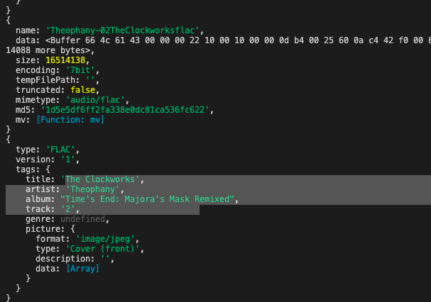
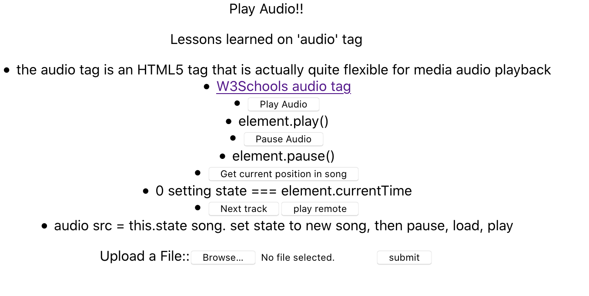

## Weekend SoloProject spike
     - the intent of this repo is to create a   
     proof of concept for my Solo Project at   
     Prime Digital Academy  
### Work completed for spike
    * playback audio with basic controls using React/HTML5 features
        > switching between tracks
        > play, pause
        > current track information
    * upload a file using axios upload request
        > dataForm 
            -- multi part file
        > cors() -- added not configed
    * receive upload using express-fileupload
        > req.files
        > .mv() move files into directory
    * read media tags (jsmediatags)
        > read song information like artist, song name, album, and album cover data
        > can be used to create more robust database instead of relying on user input
        > 

### what does it do?
    - this app allows for simple control of a 2 song track list.   
    (play, pause, next track, current position in track).  
     I also allows a user to upload an audio file (FLAC or mpeg-3 only)  
      to a given server folder.   
    - This acts as a proof of concept for how many of the features I will need for my   player will operate.

    

### Summary 
    -This was SUPER fun to put together, but it was quite a lot of work.  
    There's so much information out there about how to use <audio> tags  
    express-fileupload, and the like, but none of it really was easily laid  
     out to copy into my project here. I learned quite a lot in a short  
      period of time about how data cane be streamed, JSON headers for axios   requests, and a short and ineffective lesson on CORS...  

    Overall I'm quite pleased with how this will set me up for my work over  
    the coming weeks to create a full featured music player, and streaming  
     service.

## built With
    > node.js (prereq)
    > express
    > express-fileupload
    > cors
    > react
    > axios

## Acknowledgement
    Thank you to the instructors at Prime for both equiping me with the tools to get this far, and allowing for the freedom to try something I've never done before. 